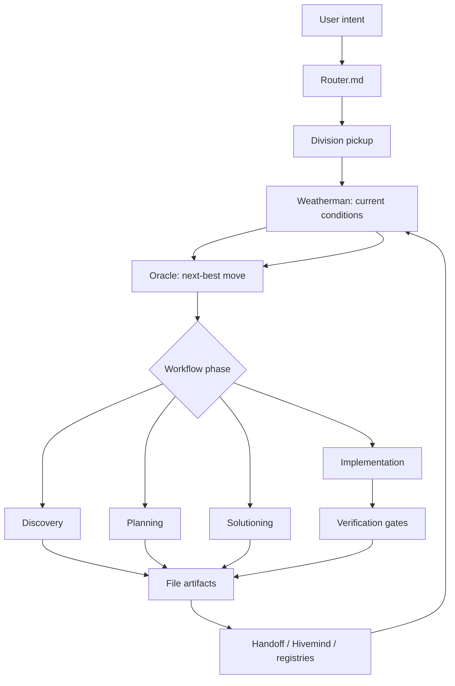

# Oracle + Weatherman Workflow

> PURPCLAW adaptation of the BMad-style greenfield workflow.
> This is an architecture and operating spec, not a UI spec.

## Purpose

PURPCLAW should not copy a linear product workflow verbatim. It already has agents, divisions, Hivemind traces, Spring doctrine, registry drift checks, an orchestrator, and read-only `oracle` / `weatherman` modules.

The useful adaptation is:

- keep the familiar phases: discovery, planning, solutioning, implementation
- put an operational layer above them
- let Weatherman observe current system conditions
- let Oracle decide the next safest, highest-value move
- write state to files so the next agent can resume without relying on chat context

## Existing Runtime Anchors

| Role | Existing File | Current Contract |
|---|---|---|
| Weatherman | `lib/weatherman.js` | Read-only system weather: services, providers, drift, Hivemind, build stamp |
| Oracle | `lib/oracle.js` | Read-only forecast: consumes weather, Hivemind, Spring, audit findings, recommends next action |
| Drift Watcher | `lib/drift-watcher.js` | Detects registry/version/capability/doc/liveweb drift; safe autofix for generated surfaces |
| Registry Audit | `lib/commands/registry-audit.js` | Read-only reconciliation report across registry surfaces |
| Hivemind | `lib/hivemind/*` | Trace recorder, skill promotion, AntiSkills, Spring doctrine |
| Orchestrator | `orchestrator.js` | Runtime workflow dispatch and SSE |
| Agent Registry | `agents/AGENT_REGISTRY.json` | Generated machine truth for agents |

Hard rule: Oracle and Weatherman advise. They do not patch, merge, quarantine, or dispatch destructive changes.

## Operating Loop



## Phase 1: Discovery

Goal: determine what is actually being built and why.

PURPCLAW flow:

```text
User
  -> Hermes / conversation intake
  -> Oracle framing
  -> Research swarm
  -> Truth scanner
  -> Memory lookup
  -> Project brief
```

Primary agents:

- Oracle: frames the problem and identifies uncertainty
- Research agent / spider / duck: gathers external or internal evidence
- Memory agent / owl: retrieves prior project state
- Truth Scanner: separates claims from verified facts
- Project Brief Generator: writes the output

Artifacts:

- `project.json`
- `vision.md`
- `constraints.md`
- `goals.md`
- `evidence.md`

Exit gate:

- the project brief names the goal, non-goals, constraints, unknowns, and evidence sources
- unsupported claims are marked as assumptions

## Phase 2: Planning

Goal: convert the brief into requirements and a navigable product surface.

PURPCLAW flow:

```text
Project brief
  -> Oracle
  -> PRD generator
  -> Requirements validator
  -> UI planner if needed
  -> UX agent if needed
  -> Architecture seeds
```

Artifacts:

- `prd.md`
- `personas.md`
- `feature_registry.json`
- `screen_inventory.md`
- `acceptance_criteria.md`
- `open_questions.md`

Exit gate:

- each feature has a user value, owner, acceptance criteria, and verification route
- UI work respects the UI freeze rules before any page/component/theme changes

## Phase 3: Solutioning

Goal: decide how to build the thing without creating duplicate systems.

PURPCLAW flow:

```text
Architecture agent
  -> Doctrine validator
  -> Existing-system scan
  -> Feature registry update
  -> Epic generator
  -> Story generator
  -> Test planner
  -> Implementation package
```

Artifacts:

- `architecture.md`
- `contracts/`
- `stories/`
- `tests/`
- `implementation_plan.md`
- `registry_delta.json`

Exit gate:

- existing code paths are named
- new files are justified
- contracts and tests are planned before implementation
- registry, Hivemind, and memory implications are explicit

## Phase 4: Implementation

Goal: ship a story through verification and memory update.

PURPCLAW flow:

```text
Sprint planner
  -> Task agent
  -> Developer agent
  -> Static analysis
  -> Unit tests
  -> Integration tests
  -> Doctrine check
  -> Feature registry check
  -> Memory / handoff update
  -> Merge-ready state
```

Quality gates:

- syntax / type checks for touched code
- focused tests for changed behavior
- registry checks when agent/skill/capability surfaces change
- `drift-watcher` shows no new registry or capability drift
- handoff file is updated with state, decisions, open tasks, and next moves

## Operational Layer

The operational layer sits above the four phases.

```text
                 Oracle
                    |
       +------------+------------+
       |            |            |
   Discovery    Planning    Solutioning
                    |
              Implementation
                    |
              Runtime Agents
                    |
                Learning
                    |
                 Memory
                    |
              Weatherman
                    |
                 Oracle
```

Oracle responsibilities:

- decide the current phase
- choose the next best move
- resolve conflicts between plans, registries, and constraints
- recommend stop/build/audit mode from evidence
- talk to the user in terms of decisions and tradeoffs

Weatherman responsibilities:

- observe live service health
- observe provider availability
- observe registry, version, docs, and liveweb drift
- observe Hivemind and build state
- report blind spots honestly
- never convert an unreachable probe into a false outage claim

## Weather Vocabulary

Weatherman should keep conditions simple:

| Condition | Meaning | Build Mode |
|---|---|---|
| clear | no meaningful warnings | normal incremental work |
| cloudy | low/medium warning exists | focused batch only |
| storm | multiple medium warnings | audit only |
| red_alert | required foundation is down | stop building, fix foundation |

Oracle consumes this condition and turns it into a next action.

## File-State Doctrine

Every phase must leave state in files.

Minimum handoff payload:

- current state
- progress completed
- decisions made
- validation run
- open tasks
- next moves

Generated registries remain generated. Do not hand-edit generated truth files except through their sync scripts.

## Adoption Plan

1. Treat this document as the workflow spec for Oracle + Weatherman behavior.
2. Add phase-aware fields to Oracle output:
   - `phase`
   - `recommended_mode`
   - `next_artifact`
   - `blocking_evidence`
3. Add workflow artifact checks to registry audit or a new workflow audit:
   - missing brief
   - missing PRD
   - missing architecture
   - stories without tests
   - implementation without handoff
4. Teach Weatherman to summarize readiness by phase, not only system health.
5. Keep implementation incremental: no new dashboard, no UI shell changes, no autonomous writes from Oracle.

## Non-Goals

- Do not implement a conventional Agile board as the source of truth.
- Do not let Oracle directly mutate files.
- Do not let Weatherman repair issues.
- Do not duplicate existing orchestrator, Hivemind, drift, registry, or memory systems.
- Do not start UI work from this spec without reading the UI freeze rules first.
